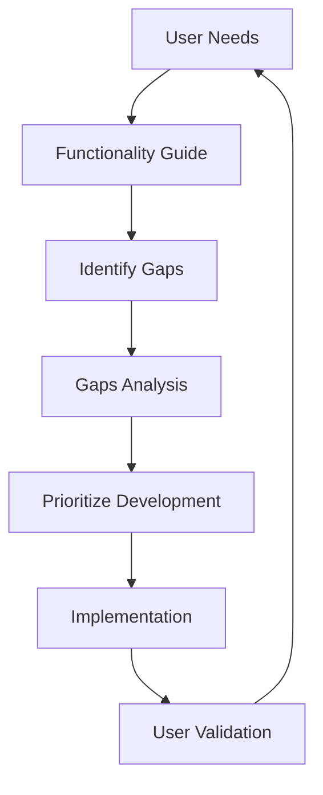

# 📚 Narrative Modeling App: Documentation Summary

## 🎯 Overview

This summary provides an overview of the two comprehensive documents created to analyze the Narrative Modeling App's current state and future potential.

## 📋 Document 1: User Perspective - Application Functionality Guide

**Location**: `docs/user_perspective/APPLICATION_FUNCTIONALITY_GUIDE.md`

**Purpose**: Provide a comprehensive guide to what the application can do from the user's perspective, explaining the current functionality and future capabilities.

### 📌 Key Sections

1. **What is the Narrative Modeling App?**
   - Clear explanation of the platform's purpose and value proposition
   - Target audience identification (business analysts, domain experts, researchers)

2. **Key Capabilities: What You Can Do**
   - **Data Loading & Management**: Drag-and-drop uploads, PII detection, large file support
   - **Data Profiling & Exploration**: Comprehensive analysis, visualizations, AI insights
   - **Data Preparation**: Visual cleaning tools, AI-powered fixes (planned)
   - **Feature Engineering**: AI-driven feature creation, optimization tools (planned)
   - **Model Training**: AI-guided algorithm selection, one-click training (planned)
   - **Model Evaluation**: Performance metrics, interpretability tools (planned)
   - **Prediction**: Single/batch predictions, confidence scoring (planned)
   - **Deployment**: REST API generation, monitoring (planned)

3. **The Narrative Workflow**
   - Detailed explanation of the 8-stage guided journey
   - How each stage builds upon the previous one
   - The storytelling metaphor that makes ML accessible

4. **AI Assistance Throughout**
   - AI chat assistant capabilities
   - AI-generated insights and recommendations
   - AI-powered automation features

5. **Security & Privacy**
   - Data protection measures
   - Compliance features
   - Access control capabilities

6. **Integration & Extensibility**
   - Current integrations (AWS S3, authentication)
   - Planned integrations (databases, APIs, business tools)

7. **User Personas & Success Stories**
   - Specific examples of who benefits and how
   - Real-world use cases and outcomes

8. **Current Limitations & Workarounds**
   - Honest assessment of what's missing
   - Practical workarounds for users
   - Clear roadmap for future development

**Audience**: Users, potential customers, marketing teams, user experience designers

**When to Use**: 
- Onboarding new users
- Marketing and sales materials
- User documentation and help center
- Training and educational resources

## 🔍 Document 2: Development Perspective - Functionality Gaps Analysis

**Location**: `docs/development/FUNCTIONALITY_GAPS_ANALYSIS.md`

**Purpose**: Identify and prioritize the critical functionality gaps that need to be addressed to make the application successful and unique in the marketplace.

### 📌 Key Sections

1. **Critical Functionality Gaps**
   - **Data Preparation**: The missing foundation (🔴 BLOCKER)
   - **Feature Engineering**: The intelligence gap (🔴 BLOCKER)
   - **Model Training**: The core missing capability (🔴 BLOCKER)
   - **Model Evaluation**: The transparency gap (🔴 BLOCKER)
   - **Prediction**: The application gap (🟡 HIGH)
   - **Deployment**: The production gap (🟡 HIGH)

2. **Workflow Integration Issues**
   - Broken workflow continuity
   - Data persistence gaps
   - State management problems

3. **AI Orchestration Gaps**
   - Missing AI decision engine
   - Limited AI integration points
   - Unfulfilled "AI-guided" promise

4. **Security & Compliance Gaps**
   - Incomplete access control
   - Missing data governance features
   - Enterprise security requirements

5. **Integration & Extensibility Gaps**
   - Limited data source connectivity
   - Missing plugin architecture
   - No extensibility framework

6. **Monitoring & Maintenance Gaps**
   - No model performance monitoring
   - Missing model lifecycle management
   - Production reliability issues

7. **Prioritized Development Roadmap**
   - Phase 1: Core Functionality (BLOCKER issues) - 3-4 months
   - Phase 2: Production Readiness (HIGH priority) - 2-3 months
   - Phase 3: AI Enhancement (MEDIUM priority) - 2-3 months
   - Phase 4: Enterprise Features (LOW priority) - 3-4 months

8. **GitHub Issue Templates**
   - Ready-to-use templates for creating development tasks
   - Clear priority assignments
   - Technical requirements and estimates

9. **Strategic Recommendations**
   - Focus on core workflow first
   - Invest in AI orchestration
   - Maintain transparency
   - Build for extensibility
   - Prioritize user experience

**Audience**: Developers, product managers, technical leads, project stakeholders

**When to Use**:
- Planning development sprints
- Creating GitHub issues and backlog
- Prioritizing feature development
- Resource allocation and budgeting
- Technical architecture decisions

## 🎯 How These Documents Work Together

### Synergy Between Documents

1. **User Perspective → Development Priorities**
   - The functionality guide shows what users expect
   - The gaps analysis shows what needs to be built to meet those expectations

2. **Current Capabilities → Future Roadmap**
   - Functionality guide: "Here's what works now"
   - Gaps analysis: "Here's what we need to build next"

3. **User Experience → Technical Implementation**
   - Functionality guide: "Here's how users will experience it"
   - Gaps analysis: "Here's how we'll implement it"

### Decision-Making Framework

## 🚀 Strategic Value

### For Product Success
- **Clear vision**: Both documents provide a unified vision of what the product should become
- **Prioritized roadmap**: Development resources can be allocated effectively
- **User-centric development**: Features are built based on real user needs
- **Market differentiation**: Focus on unique value proposition (narrative workflow + AI orchestration)

### For Development Efficiency
- **Reduced ambiguity**: Clear technical requirements for each feature
- **GitHub-ready issues**: Templates that can be directly used for task creation
- **Phased approach**: Logical progression from core functionality to advanced features
- **Risk mitigation**: Address critical gaps before they become blockers

### For User Adoption
- **Realistic expectations**: Users understand current capabilities and future potential
- **Clear roadmap**: Users can see what's coming and when
- **Workaround guidance**: Users know how to work with current limitations
- **Success stories**: Users can envision how they'll benefit

## 📋 Action Plan

### For Development Teams

1. **Review the Gaps Analysis**
   - Understand the critical BLOCKER issues
   - Familiarize with the prioritized roadmap
   - Study the GitHub issue templates

2. **Create Development Tasks**
   - Use the provided templates to create GitHub issues
   - Assign priorities based on the roadmap
   - Break down large features into manageable tasks

3. **Implement Core Functionality**
   - Start with data preparation (Stage 3)
   - Progress through feature engineering (Stage 4)
   - Implement model training (Stage 5)
   - Add model evaluation (Stage 6)

4. **Enhance AI Orchestration**
   - Build the AI decision engine
   - Integrate AI guidance at each stage
   - Ensure transparency and explainability

5. **Add Production Features**
   - Implement prediction services
   - Build deployment framework
   - Add monitoring and maintenance

### For Product Teams

1. **Use Functionality Guide for Marketing**
   - Create user-facing documentation
   - Develop training materials
   - Build sales and marketing collateral

2. **Communicate Roadmap**
   - Share the development timeline with users
   - Set realistic expectations
   - Highlight upcoming features

3. **Gather User Feedback**
   - Validate the identified gaps
   - Prioritize based on user needs
   - Refine the narrative workflow

### For Leadership

1. **Resource Allocation**
   - Allocate development resources based on priorities
   - Plan budget for the 4-phase roadmap
   - Set realistic timelines for MVP completion

2. **Market Positioning**
   - Use the unique value proposition for differentiation
   - Highlight the narrative workflow and AI orchestration
   - Position as the "no-code, not no-control" solution

3. **Success Measurement**
   - Define metrics for each development phase
   - Track progress against the roadmap
   - Measure user adoption and satisfaction

## 🎯 Conclusion

These two documents provide a comprehensive foundation for transforming the Narrative Modeling App from its current state to a market-leading platform:

1. **User Perspective Document**: Shows the destination - what users need and expect
2. **Gaps Analysis Document**: Provides the roadmap - how to get there efficiently

Together, they create a powerful framework for:
- **Development**: Clear technical requirements and priorities
- **Product Management**: User-centric feature planning and roadmapping
- **Marketing**: Compelling user stories and value proposition
- **Leadership**: Strategic decision-making and resource allocation

**Next Steps**:
1. Review both documents with the development team
2. Create GitHub issues using the provided templates
3. Begin implementation with the BLOCKER priority items
4. Maintain regular progress reviews against the roadmap
5. Update documents as development progresses and new insights emerge

By systematically addressing the identified gaps while maintaining the unique narrative workflow and AI orchestration approach, the Narrative Modeling App can achieve its vision of democratizing machine learning for business professionals.